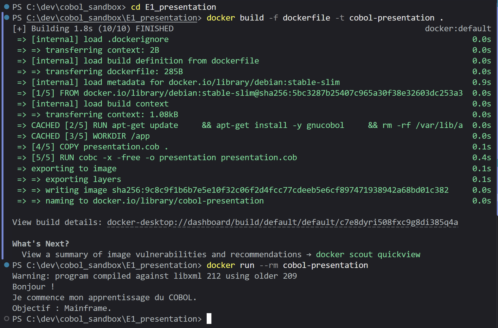
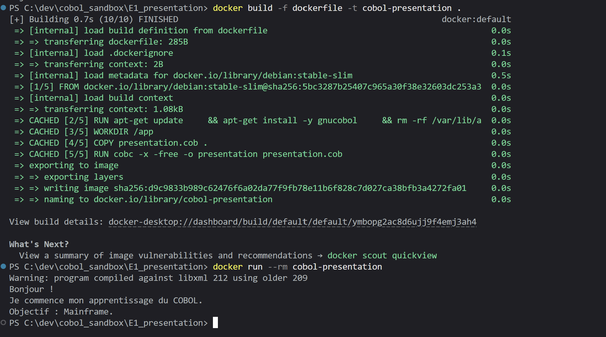

dockerfile

Ici je documente mon raisonnement lorsque je fait un exercise.

## Exercice 1 :

### Résultat attendu

Ecrrire un programme cobol appelé PRESENTATION qui produit

```
Bonjour !
Je commence mon apprentissage du COBOL.
Objectif : Mainframe.
```

en utilisant au moins une variable pour l'affichage

### Developpement

JE vais donc faire un programme cobol dans le dossier E1_presentation qui sera appelé presetation. Je vais donc le dockerfile appelera presentation.cob

Ensuite dans le fichier je mettrais la valeur PRESENTATION à program ID

```cobol
PROGRAM-ID. PRESENTATION.
```

Je vais faire 2 variables une variable WS-DOING qui contiens al seconde chaine de caractère et la variable WS-OBJECTIF qui contiendra ce qui est affiché après OBEJECTIF

la variable WS-DOING sera une variable de 40 caractères et la variable WS-OBJECTIF une variable de 20 caractères.

```cobol
01 WS-DOING PIC X(40).
01 WS-OBJECTIF PIC X(20).
```

J'attribuent leurs valeurs respectives aux variables vu=ia MOVE

```cobol
MOVE "Je commence mon apprentissage du COBOL." TO WS-DOING.
MOVE "Mainframe." TO WS-OBJECTIF.
```

J'ai posé la question sur le retour à la ligne en cobol, il m'a indiquer suffit d'ajouter un ligne display pour le retour à la ligne, etr que l'on pouvais l'annuler avec l'instruction

```cobol
WITH NO ADVANCING.
```

Ainsi j'ai trsucturé l'affichage du resultrat de la façon suivante dans PROCEDURE DIVISION. :

```cobol
PROCEDURE DIVISION.
    MOVE "Je commence mon apprentissage du COBOL." TO WS-DOING.
    MOVE "Mainframe." TO WS-OBJECTIF.
    DISPLAY "Bonjour !"
    DISPLAY WS-DOING
    DISPLAY "Objectif : " WITH NO ADVANCING.
    DISPLAY WS-OBJECTIF.
```

#### Premier test :



Exercice réussi

Mais je peut diminuer l'espace mémoire consommé en adaptant davantage la taille des variable a celle de leur contennu.

```cobol
01 WS-DOING PIC X(39).
01 WS-OBJECTIF PIC X(10).
```

Le résultat reste inchangé mais l'espace mémoire consommé est desormais plus faible:

